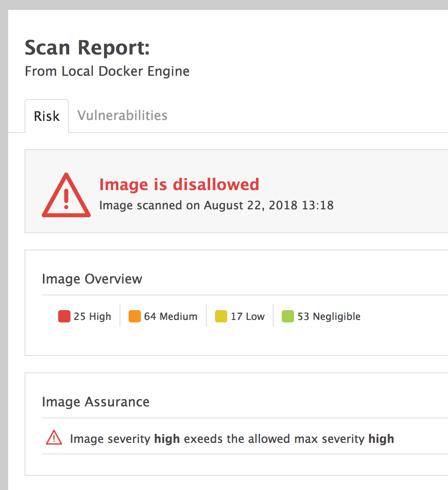
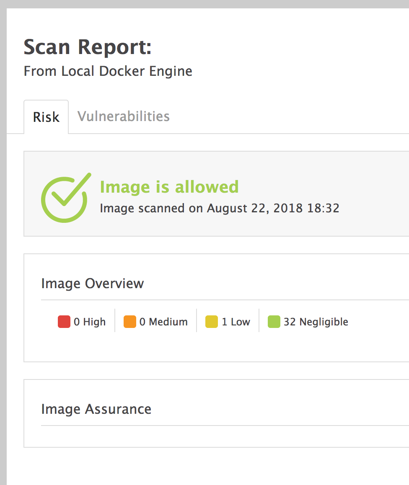
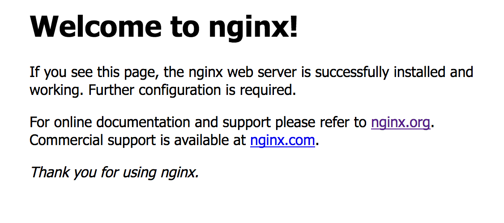
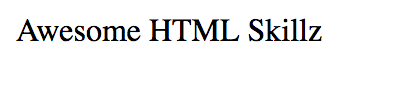

# Builders Lab: Efficient and Secure Containers

### Take Aways

In this lab you'll learn best practices and how use tools to check the security of your containers. You'll also learn how to make your container efficient as a small container size will ultimately give you greater flexibility and faster start times.

### Requirements

- Docker installed locally
- Aqua microscanner installed [https://github.com/aquasecurity/microscanner](https://github.com/aquasecurity/microscanner)
- microscanner-wrapper installed [https://github.com/lukebond/microscanner-wrapper](https://github.com/lukebond/microscanner-wrapper)

### Expected Time

This lab should take about 1 hour.

## Getting started

We are going to start off with a basic Dockerfile and improve it along the way, each time making it more secure and eventually we'll look at the efficiency.

Our starting point is going to be ugly and a bad example of a Dockerfile. By the time we finish it'll be better I promise.

Create a Dockerfile in a new directory (you can also find this code in the git directory ```container/debian/v1```

```docker
FROM debian:wheezy

RUN apt-get update
RUN apt-get install -y samba nginx openssl git wget curl
```

Now lets build that image by running the following commands:

```bash
docker build -t bl_test:v1 .
```

You'll get lots of output as the image is built and packages are installed. Once complete you can check the size of your container by running the following:

```bash
docker images


REPOSITORY          TAG                 IMAGE ID            CREATED             SIZE
bl_test             v1                  4fec540b803b        8 seconds ago       238MB
debian              wheezy              2d79c539d0db        5 weeks ago         88.3MB
```
This will become more important later on in the lab.

## Security: Locking it down

Now lets start looking at the security of that container!

### Scanning: Updates, updates, updates

We are going to use aqua's microscanner project to test this locally and see how we can improve the image. First of all make sure you have it installed and also clone the wrapper repository, you'll need to follow the microscanner registration in order to get your token. I then ran the following in my terminal window:

```bash
export MICROSCANNER_TOKEN="YOUR_TOKEN"
```
This setups up the token that microscanner uses in order to check the CVE db and aqua's database.

Change into the wrapper repository and run the following command:

```bash
/grabhtml.sh bl_test:v1 > v1.html
```

This is going to scan your image :) The output will be saved into a new file called v1.html and if you open that in your browser you should get the following output (or worse if there are new exploits from the time of writing this lab)



As you can see this container is not very secure. So lesson 1 check whats in that container, update and use the latest versions. For example there is no need to run an old version of debian wheezy so lets switch that up to debian stretch, lets do an ```apt upgrade``` also and ensure we have a good foundation.

Lets modify your Dockerfile:

```Dockerfile
FROM debian:stretch

RUN apt update
RUN apt upgrade -y
RUN apt install -y samba nginx openssl git wget curl

```

Now lets build that image:

```bash
docker build -t bl_test:v2 .
```

Once its built lets rescan:

```bash
/grabhtml.sh bl_test:v2 > v2.html
```

Open the ```v2.html``` file in your browser and you should see i noted improvement.



Not perfect but at least you'll see the image have no High or Medium security threats.

### Who are you: user permissions

So at the moment when you run this container, in that container you are root. You can do anything, lets try by executing and dropping into the container shell:

```bash
docker run -it bl_test:v2 bash

root@6e55ba499e63:/#
```

Now try running apt for example, something normally only an admin would do.

```bash
root@6e55ba499e63:/# apt install cowsay
Reading package lists... Done
Building dependency tree
Reading state information... Done
The following additional packages will be installed:
  cowsay-off libtext-charwidth-perl
Suggested packages:
  filters
The following NEW packages will be installed:
  cowsay cowsay-off libtext-charwidth-perl
0 upgraded, 3 newly installed, 0 to remove and 0 not upgraded.
Need to get 37.8 kB of archives.
After this operation, 155 kB of additional disk space will be used.
Do you want to continue? [Y/n] y
Get:1 http://deb.debian.org/debian stretch/main amd64 libtext-charwidth-perl amd64 0.04-7+b5 [9870 B]
Get:2 http://deb.debian.org/debian stretch/main amd64 cowsay all 3.03+dfsg2-3 [20.1 kB]
Get:3 http://deb.debian.org/debian stretch/main amd64 cowsay-off all 3.03+dfsg2-3 [7816 B]
Fetched 37.8 kB in 0s (616 kB/s)
debconf: delaying package configuration, since apt-utils is not installed
Selecting previously unselected
....
...
..
.
```
Ok so why wouldn't we want this? Well imagine someone has exploited your application...... yep they could potentially install anything in that container. So lets lock down the permissions. We are going to add a user called test then tell the container thats what its processes run as.

```Dockerfile
FROM debian:stretch

RUN apt update
RUN apt upgrade -y
RUN apt install -y samba nginx openssl git wget curl

RUN useradd -ms /bin/bash test
USER test
```

Now drop into the docker shell again:

```bash
8c85904b420b:~ rjh$ docker run -it bl_test:v3 bash
test@58a4553bf0f7:/$
```

Notice the user??? Now try and do the same things as before.

```bash
test@58a4553bf0f7:/$ apt install cowsay
E: Could not open lock file /var/lib/dpkg/lock - open (13: Permission denied)
E: Unable to lock the administration directory (/var/lib/dpkg/), are you root?
```

Much better!

### Further ways to secure!

Now there are lots more things you can do, the two examples above show you the basics. You should consider using [seccomp](https://docs.docker.com/engine/security/seccomp/) to restrict permissions. Lets try a simple example of this. Create a ```policy.json``` file

```json
{
  "defaultAction": "SCMP_ACT_ALLOW",
  "syscalls": [
    {
      "name": "mkdir",
      "action": "SCMP_ACT_ERRNO"
    },
    {
      "name": "chown",
      "action": "SCMP_ACT_ERRNO"
    }
  ]
}
```

Now run your container like so:

```bash
docker run -it --security-opt seccomp:policy.json bl_test:v3 bash
```

Now lets put it to the test:

```bash
cd /home/test
mkdir moo

test@6179afa3b697:~$ mkdir moo
mkdir: cannot create directory 'moo': Operation not permitted
```

The same thing would happen for the chown command and you can bulk out this policy to really lock your containers down.

### How about in production?????

It depends on your orchestrator. In fact there is going to be another Builders Lab in this series all about IAM permissions for containers in ECS and Fargate. Stay tuned!

## Efficiency: Whats in a container

### Slim down

Ok we are now a lot more secure but our container kinda sucks. Its pretty large its size on disk is: ~403mb

A quick win is to lock to see if you have a slim version of the base container we are using in our case debian at the moment. Tweak your Dockerfile:

```Dockerfile
FROM debian:stretch-slim

RUN apt update
RUN apt upgrade -y
RUN apt install -y samba nginx openssl git wget curl

RUN useradd -ms /bin/bash test
USER test
```

And lets build v4 of our image:

```bash
docker build -t bl_test:v4 .
```

Now lets look at the sizes:

```bash
docker images

REPOSITORY          TAG                 IMAGE ID            CREATED              SIZE
bl_test             v4                  1ae6bbd5b4db        About a minute ago   328MB
bl_test             v3                  039e60aad085        31 minutes ago       403MB
...
```

You can see its smaller but we want it smaller. Firstly lets look at this image. A container should really only run one process if possible. So lets just make it run nginx and get rid of things like samba!

```Dockerfile
FROM debian:stretch-slim

RUN apt update
RUN apt upgrade -y
RUN apt install -y nginx

USER www-data
```

Note: I've stripped out unwanted packages and changed the user to www-data which is the default user debian uses for the web server. Lets see the image size now:

```bash
docker images

REPOSITORY          TAG                 IMAGE ID            CREATED              SIZE
bl_test             v5                  0ea9f24afc8f        About a minute ago   128MB
```

Much smaller, this is a great start.

### Lets talk about layers

Ok so we have a smaller image, but lets play with layers and see how they work. Each layer is a delta of the one before. Each time you run a ADD, COPY or RUN command etc. in your Dockerfile you create a new delta/layer. This means that if uninstalled software in a run command, the image size would not go down! Lets see this in action:

```dockerfile
FROM debian:stretch-slim

RUN apt update
RUN apt upgrade -y
RUN apt install -y samba nginx openssl git wget curl


RUN apt remove -y samba openssl git wget curl
# everything but nginx

RUN useradd -ms /bin/bash test
USER test
```

Build it again:

```bash
docker build -t bl_test:v6 .
```

now lets look at the sizes:

```bash
docker images

REPOSITORY          TAG                 IMAGE ID            CREATED             SIZE
bl_test             v6                  da1a594a2314        10 seconds ago      330MB
bl_test             v5                  0ea9f24afc8f        6 minutes ago       128MB
bl_test             v4                  1ae6bbd5b4db        11 minutes ago      328MB
```

The image although containing the same packages as v6 is now bigger than v4! This is because the data is still in the delta.

To get around this you can chain commands. This way they run in the same layer and clean out data.

```Dockerfile
FROM debian:stretch-slim

RUN apt update \
    && apt upgrade -y \
    && apt install --no-install-recommends --no-install-suggests -y samba nginx openssl git wget curl \
    && apt remove --purge --auto-remove -y samba openssl git wget curl \
    && rm -rf /var/lib/apt/lists/*
    # Clear up the cache also

USER www-data
```

Build it:

```bash
docker build -t bl_test:v7 .
```

and look at the size:

```
docker images

REPOSITORY          TAG                 IMAGE ID            CREATED             SIZE
bl_test             v7                  deccfd08ccd8        2 minutes ago       105MB
```

Much lighter, some extra commands for apt also helped reduce the size. In fact you can see it has less layers by looking at docker inspect for each image:

```bash
docker inspect bl_test:v7

...
        "RootFS": {
            "Type": "layers",
            "Layers": [
                "sha256:cdb3f9544e4c61d45da1ea44f7d92386639a052c620d1550376f22f5b46981af",
                "sha256:62f6e4e850e8aeba5f748ad599d45e4bd8f088ed9eab9c690f224c383012f643"
            ]
...
```

This image has 2 laters compared to v6 with 6 layers!

### Just make it run!

Right before we go further lets make our container just run nginx!

```Dockerfile
FROM debian:stretch-slim

RUN apt update \
    && apt upgrade -y \
    && apt install --no-install-recommends --no-install-suggests -y samba nginx openssl git wget curl \
    && apt remove --purge --auto-remove -y samba openssl git wget curl \
    && rm -rf /var/lib/apt/lists/*
    # Clear up the cache also

EXPOSE 80

CMD ["nginx", "-g", "daemon off;"]
```

Build it:

```bash
docker build -t bl_test:v8 .
```

Now run it:

```bash
docker run -d -p 80:80 bl_test:v8
```

If you browse to [http://127.0.0.1](http://127.0.0.1) you should see the nginx welcome page!



Note: please stop and remove this container

### Consider other OS's

Look at alpine linux to start. Its super lightweight. In fact lets build an alpine linux container to run nginx and see how it goes!

```Dockerfile
FROM alpine:latest

RUN apk update \
    && apk upgrade \
    && apk add --no-cache nginx bash\
    && adduser -D -g 'www' www \
    && mkdir /www \
    && mkdir -p /run/nginx/ \
    && chown -R www:www /var/lib/nginx \
    && chown -R www:www /www

COPY nginx.conf /etc/nginx/nginx.conf
COPY index.html /www

EXPOSE 80

CMD ["nginx", "-g", "daemon off;"]
```

NOTE: you'll also need the nginx.conf and index.html file out of this repository, before building:

```bash
docker build -t bl_test:v9 .

docker run -d -p 80:80 bl_test:v9
```

You'll see:



The best part of this is the image size:

```bash
REPOSITORY          TAG                 IMAGE ID            CREATED             SIZE
bl_test             v9                  4d0085c761df        2 minutes ago       11.9MB
```

## Taking this further???

Take a look at building scratch images [https://hub.docker.com/_/scratch/](https://hub.docker.com/_/scratch/)


            

